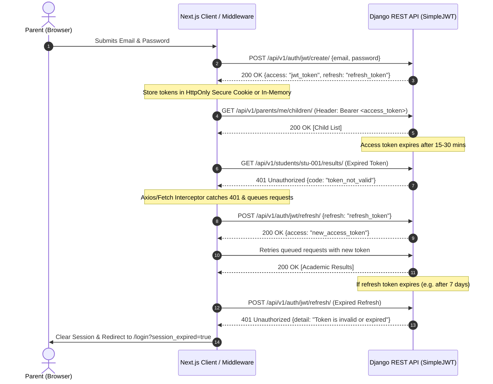

# Katalysa Parent Portal — Frontend Technical Assessment

A responsive, production-ready **Parent Dashboard** built for **Katalysa** (School Management SaaS). Developed with **Next.js (App Router)**, **TypeScript**, **Tailwind CSS**, and **Zustand**, following clean architectural principles, decoupled service layers, status-driven UI reactivity, and a robust Django REST Framework JWT authentication integration strategy.

---

## 🚀 Live Demo & Quick Start

### Prerequisites
- Node.js 18.18+ or 20+
- npm / yarn / pnpm

### Installation & Running Locally

```bash
# Clone the repository
git clone https://github.com/<your-username>/parent-portal.git

# Navigate to project root
cd parent-portal

# Install dependencies
npm install

# Run the development server
npm run dev
```

Open [http://localhost:3000](http://localhost:3000) in your browser.

---

## 🛠️ Tech Stack & Decisions

| Technology | Purpose | Rationale |
| :--- | :--- | :--- |
| **Next.js 16 (App Router)** | Framework | Server-side rendering, nested layouts, optimized asset bundling, and clean route grouping. |
| **TypeScript (Strict Mode)** | Language | 100% type safety across models, DTOs, service responses, and component props; prevents runtime regressions. |
| **Tailwind CSS v4** | Styling | Utility-first styling with modern design tokens, seamless dark/light contrast, and fluid responsive utilities down to 375px mobile viewports. |
| **Zustand** | State Management | Lightweight, hook-based global state management without provider boilerplate; handles active child selection, auth tokens, and live mock simulation. |
| **jsPDF** | PDF Engine | Fully functional client-side certified PDF generation for official school terminal report cards. |
| **Lucide React** | Icons | Consistent, accessible icon set with low bundle footprint. |

---

## 🏛️ Architectural Overview & Folder Structure

The project follows a **domain-driven, layered frontend architecture** that strictly decouples UI components from API communication and data manipulation.

```
src/
├── app/                           # Next.js App Router pages and layouts
│   ├── layout.tsx                 # Root layout & global CSS tokens
│   ├── page.tsx                   # Main Parent Dashboard (Overview, Active Child, Fees & Results preview)
│   ├── login/                     # Authentication route with demo auto-fill
│   ├── fees/                      # Dedicated Fees & Payment History view
│   ├── results/                   # Dedicated Academic Results & Subject Breakdown view
│   └── not-found.tsx              # Custom 404 page
├── components/
│   ├── auth/                      # AuthGuard and LoginForm
│   ├── dashboard/                 # ParentWelcome, ChildSelector, StudentStatusBanner, QuickStats
│   ├── fees/                      # FeeSummaryCard, PaymentHistoryTable, PaymentEmptyState
│   ├── results/                   # AcademicSummaryCard, ResultsTable, ResultsEmptyState
│   ├── layout/                    # Header, Sidebar, MobileNav (~375px), DemoToolbar
│   ├── shared/                    # ErrorCard, EmptyState
│   └── ui/                        # Reusable atomic UI (Button, Badge, Card, Modal, Skeleton, Alert)
├── lib/
│   ├── constants.ts               # School metadata, grading scales (WAEC/Cambridge), sessions, terms
│   ├── formatters.ts              # Currency (₦), dates, ordinals (1st, 2nd, 3rd), grade color mappings
│   ├── pdf-generator.ts           # jsPDF engine generating certified Katalysa report cards
│   └── utils.ts                   # Class name merging (clsx + tailwind-merge)
├── services/
│   ├── api/
│   │   ├── client.ts              # Decoupled HTTP client with token injection & simulated latency
│   │   ├── auth.service.ts        # Login, logout, refresh token, user profile
│   │   ├── students.service.ts    # getChildren, getChildById
│   │   ├── fees.service.ts        # getFeeSummary, getPaymentHistory
│   │   └── results.service.ts     # getAcademicResults, downloadResultPdf
│   └── mock/
│       └── mockData.ts            # Realistic Nigerian educational dataset (SS1, JSS1, Alumni, etc.)
├── store/
│   ├── useAuthStore.ts            # Authentication state, JWT tokens, login/logout actions
│   ├── usePortalStore.ts          # Selected child, term filters, data orchestration, evaluator simulator
│   └── useUiStore.ts              # Modals and mobile navigation drawer
└── types/
    ├── api.ts                     # ApiResponse, ApiError, MockScenario
    ├── auth.ts                    # ParentUser, JwtTokenPair, LoginCredentials
    ├── fees.ts                    # FeeSummary, PaymentRecord, PaymentStatus
    ├── results.ts                 # AcademicResult, SubjectScore, GradingScaleEntry
    └── student.ts                 # Student, ClassInfo, StudentStatus
```

---

## 🎯 Key Assessment Deliverables

### 1. Parent & Multi-Child Switching
- Displays parent profile (**Dr. Babatunde Adeleke**) and associated children.
- Multi-child switcher supporting seamless switching across students in various grades.
- **Status Reactivity**:
  - `Active` (e.g. *Chidiebere Adeleke* - SS1 Diamond & *Amara Adeleke* - JSS1 Gold): Full dashboard access, real-time CA1/CA2/Exam scores, and fee settlement.
  - `Graduated` (e.g. *Kelechi Adeleke* - Class of 2024 Alumni): Displays alumni honors banner, archived transcripts, and WAEC certificate validation.
  - `Withdrawn` (e.g. *Somto Adeleke* - JSS3): Official withdrawal alert, archived academic records, deactivated billing actions.
  - `Inactive` (e.g. *Zainab Adeleke* - JSS2): Administrative alert with direct call-to-action to contact the school bursar.

### 2. Fee Summary & Payment History
- Displays exact figures as specified:
  - **Total Fees**: `₦55,000`
  - **Amount Paid**: `₦25,000`
  - **Outstanding Balance**: `₦30,000`
  - **Payment Status**: `Partial` (with visual completion bar)
- Includes **Itemized Fee Breakdown Modal** (Tuition, ICT Lab, Sports, PTA Levy).
- **Payment History Section**: Shows past payments with Date, Receipt Number, Reference, Channel (Bank Transfer, Paystack, Flutterwave), Amount, and Receipt View Modal.

### 3. Academic Results & Real Functional PDF Generation
- Continuous Assessment breakdown table matching the assessment specification:
  - `Subject | CA1 (20) | CA2 (20) | Exam (60) | Total (100) | % | Grade | Remark`
  - Example row: `Mathematics | 18 | 15 | 52 | 85 | 85% | A | Good`
- Displays **Overall Average** (`85.0%`), **Position in Class** (`2nd of 38`), Class Highest Benchmark (`89.4%`), and Teacher/Principal remarks.
- **Download Result PDF**: Powered by `jsPDF`, clicking "Download PDF" generates and downloads a certified Katalysa Terminal Report Card complete with school header, student biodata, subject breakdown table, principal remarks, and official seal watermark. An in-app **PDF Preview Modal** is also available.

### 4. Evaluator Control Toolbar
A floating evaluator toolbar at the bottom right allows reviewers to test all scenarios instantly:
- Switch active student statuses (`Active`, `Graduated`, `Withdrawn`, `Inactive`)
- Toggle **Loading Skeletons**
- Toggle **API Error (503)** with Retry Trigger
- Toggle **Empty Children** State
- Toggle **Empty Payments** State
- Toggle **Empty Results** State

---

## 🔒 Authentication & Django REST Framework (DRF) JWT Architecture

Here is the technical specification for how frontend authentication interfaces with a production **Django REST Framework + SimpleJWT** backend.



### Key Questions Addressed:

#### 1. Where to store access/refresh tokens?
- **Recommended Production Strategy**: Store the `refresh_token` in an **`HttpOnly`, `Secure`, `SameSite=Strict` Cookie** set directly by the Django backend response. Store the short-lived `access_token` in memory (Zustand store or React state) with an optional Next.js API Route proxy.
- **Why**: This eliminates Cross-Site Scripting (XSS) vulnerability risks because JavaScript cannot read `HttpOnly` cookies.

#### 2. How to attach the access token to API requests?
- In the API client (`src/services/api/client.ts`), a request interceptor automatically extracts the active token from state and injects the header:
  ```typescript
  headers['Authorization'] = `Bearer ${accessToken}`;
  ```

#### 3. What happens when the access token expires?
- The DRF backend responds with `HTTP 401 Unauthorized` and payload `{"code": "token_not_valid", "messages": [{"token_class": "AccessToken", "token_type": "access", "message": "Token is invalid or expired"}]}`.
- The client interceptor catches the 401, pauses all outgoing requests in a pending queue, and initiates silent token refresh.

#### 4. How to refresh the token without race conditions?
- Use a **mutex / promise queue**:
  ```typescript
  let isRefreshing = false;
  let refreshSubscribers: ((token: string) => void)[] = [];

  const onTokenRefreshed = (token: string) => {
    refreshSubscribers.forEach((cb) => cb(token));
    refreshSubscribers = [];
  };

  async function handle401Error(failedRequest) {
    if (!isRefreshing) {
      isRefreshing = true;
      try {
        const response = await fetch('/api/v1/auth/jwt/refresh/', { method: 'POST', body: JSON.stringify({ refresh: refreshToken }) });
        const { access } = await response.json();
        setToken(access);
        onTokenRefreshed(access);
        return retryRequest(failedRequest, access);
      } catch (err) {
        logoutAndRedirect();
      } finally {
        isRefreshing = false;
      }
    }

    return new Promise((resolve) => {
      refreshSubscribers.push((newToken) => {
        resolve(retryRequest(failedRequest, newToken));
      });
    });
  }
  ```

#### 5. What happens if the refresh token also expires?
- When the refresh token is expired or blacklisted, the `/api/v1/auth/jwt/refresh/` endpoint returns `HTTP 401 Unauthorized`.
- The client immediately purges all local auth state and redirects the user to `/login?session_expired=true&redirect=/`.

#### 6. How unauthenticated users are redirected to login?
- Handled at both the **Next.js Middleware layer** (for SSR routes) and the **`AuthGuard` client component** (`src/components/auth/AuthGuard.tsx`), preventing flashes of protected content.

---

## 📱 Responsive Implementation & Mobile 375px Strategy

To meet the mobile requirement (~375px iPhone SE / standard Android width):
1. **Responsive Results Presentation**:
   - On Desktop (≥640px): A full tabular breakdown with subject, CA1, CA2, Exam, Total, Grade, and Remarks.
   - On Mobile (<640px): A dedicated **Card View** that displays each subject in a self-contained card with assessment badges, eliminating horizontal scrolling while keeping numbers legible. An interactive toggle allows parents to choose between "Cards" and "Table" views.
2. **Touch Targets**: All interactive buttons, tabs, and toggles have a minimum height of `44px` and generous padding.
3. **Navigation**: Bottom sticky navigation bar on small devices, complemented by a smooth slide-out drawer.

---

## 🔗 Integrating Frontend with Real Django REST Framework APIs

When switching from mock data to the live DRF backend:

1. **Set Environment Variable**:
   ```env
   NEXT_PUBLIC_API_URL=https://api.katalysa.edu.ng/api/v1
   ```
2. **Configure DRF CORS & SimpleJWT Settings**:
   ```python
   # settings.py
   CORS_ALLOWED_ORIGINS = [
       "https://portal.katalysa.edu.ng",
       "http://localhost:3000",
   ]
   CORS_ALLOW_CREDENTIALS = True

   SIMPLE_JWT = {
       "ACCESS_TOKEN_LIFETIME": timedelta(minutes=30),
       "REFRESH_TOKEN_LIFETIME": timedelta(days=7),
       "ROTATE_REFRESH_TOKENS": True,
       "BLACKLIST_AFTER_ROTATION": True,
       "AUTH_HEADER_TYPES": ("Bearer",),
   }
   ```
3. **Endpoint Mapping**:
   - `POST /api/v1/auth/jwt/create/` ➡️ `authService.login()`
   - `POST /api/v1/auth/jwt/refresh/` ➡️ `authService.refreshToken()`
   - `GET /api/v1/parents/me/children/` ➡️ `studentsService.getChildren()`
   - `GET /api/v1/students/{id}/fees/summary/` ➡️ `feesService.getFeeSummary()`
   - `GET /api/v1/students/{id}/payments/` ➡️ `feesService.getPaymentHistory()`
   - `GET /api/v1/students/{id}/results/` ➡️ `resultsService.getAcademicResults()`

---

## 📝 Assumptions Made

1. **Currency**: The school operates in Nigeria, using Nigerian Naira (`₦`), standard for West African educational institutions.
2. **Continuous Assessment Schema**: Continuous Assessment 1 (max 20) + Continuous Assessment 2 (max 20) + Final Exam (max 60) = 100% aggregate total, matching WAEC and Nigerian Ministry of Education standards.
3. **Guardian-Student Relationship**: A single parent user account may have multiple children enrolled simultaneously across different classes and statuses.
4. **Result Moderation**: Unreleased or in-progress term results are locked under academic moderation until approved by the school principal.

---

## 👨‍💻 Author
**Kingsley** — Senior Frontend Developer  
Assessment: Katalysa School Management SaaS Parent Portal
